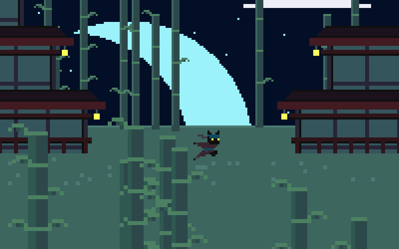

# Black Cat Shinobi

Is a platform game were you need to perform jumps and acrobatics moves to find the Torii gates to finish your shinobi missions.

You can play a live version here: https://igorfie.gitlab.io/black-cat-shinobi/

This game was created for the [2025 js13kGames](https://js13kgames.com/) where the theme was `Back Cat`.

## Game instructions
- Use keyboard `Left`/`Right` Arrows or `A`/`D` to move character Sideways
- Use `Up` arrow or `W` to jump
- Hold Jump to glide during or after a jump
- Use `Down` arrow or `S` to fall

## TODO-FOR-FUTURE-ME
- Refactor/reorganize all the code
- Add enemies to game that pursuit you and throw shurikens at you
- Add player shuriken attack, so he can defect enemies shurikens and defeat them
- Add arrow dispensers

### Setup
Run `npm install` on a terminal

### Development
Run `npm run start` to start the game in a development server on `localhost:8080`.

### Production
Use `npm run build` to create minified file and zip him with the `index.html`. The result will be available in the `build` directory.